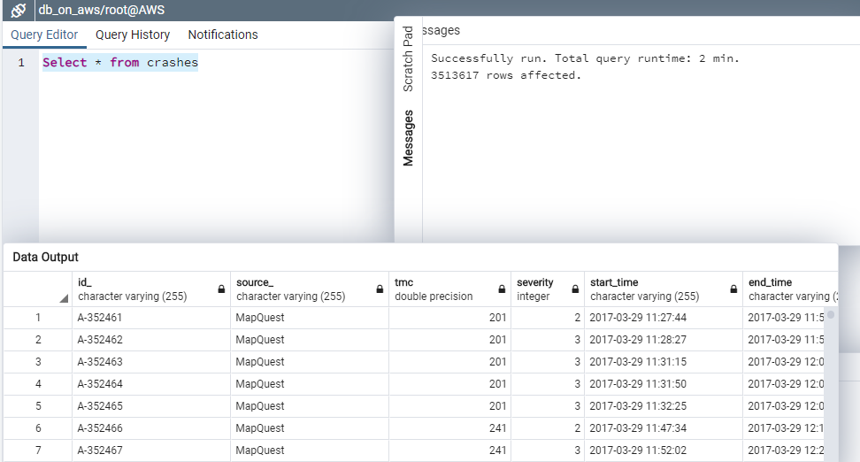
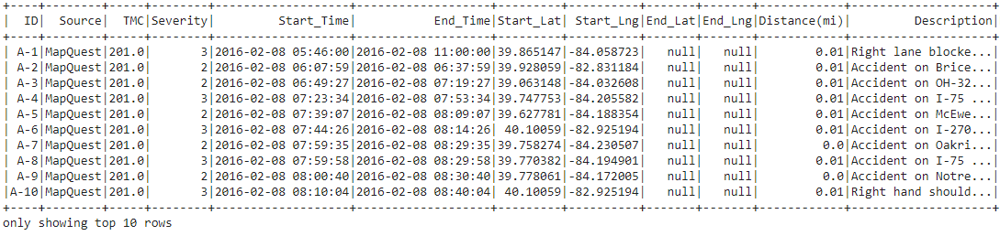
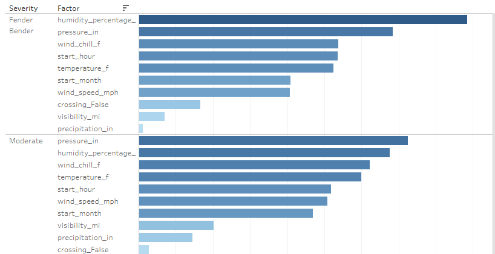
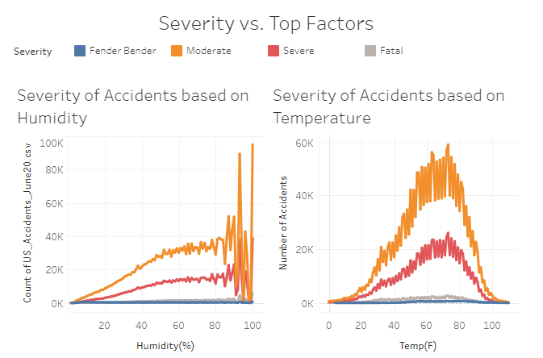

# Car Crashes Machine Learning Analysis

## Introduction

A look into recent traffic accident information. This file contains details of 3.5 million traffic accidents that took place in the United States, from February 2016 to June 2020.\

## Our Dependecies

- AWS - S3 (bucket) and RDS (to share publicly)
- Google Collab
- Spark 3.0 from http://www-us.apache.org/dist/spark/
- Python 3.7
- PostgreSQL 12 - (Download on https://www.postgresql.org/ and open with PGAdmin4)
- Tableau: Public
- Traffic Crash data in `US_Accidents_June20.csv`
- Pandas (`pip install pandas`)
- Jupyter Notebook (`pip install jupyter notebook`)
- MatPlotLib (`pip install matplotlib`)
- Numpy (`pip install numpy`)
- SQLAlchemy (`pip install sqlalchemy`)
- Sci-kit Learn (`pip install -U scikit-learn`)

Dataset provided by Kaggle on the following link:
https://www.kaggle.com/sobhanmoosavi/us-accidents

# ETL Phase 1 - Getting Started through the Cloud

## Step 1:

Once AWS account is created use RDS to create a Database instance. Use S3 to upload the `US_Accidents_June20.csv` file. Make it public through Settings and grab Object URL. 
- Host name: db-inst-on-aws.cfx0x80oubi1.us-east-1.rds.amazonaws.com
- Port: 5432.

## Step 2:

Open Google Collab, import os and enter the spark version for example: spark_version = 'spark-3.0.1'. Create os.environ as spark_version. Create a Spark session and Import PostgreSQL JDBC Driver (PgJDBC for short). This allows Java programs to connect to a PostgreSQL database using standard, database independent Java code. Is an open source JDBC driver written in Pure Java (Type 4), and communicates in the PostgreSQL native network protocol.

## Step 3:

From pyspark.sql import SparkSession and config with PostgreSQL JDBC Driver. From pyspark import SparkFiles and import Object URL created from S3 (`US_Accidents_June20.csv`). Create a dataframe. Examine the schema to further rename columns and use as guide for table schemata in Postgres.\

## Step 4:

Write DataFrame to RDS. Using the endpoint and port we configure the RDS instance. We then write this DataFrame to the table in PostGres. Now we have a free Database to work from.

# ETL Phase 2 - Testing and Training Machine Learning Models

## Step 5:

Open a Jupyter Notebook and from SQLAlchemy create an engine bridging the Postgres Database to Juptyer Notebook and connect. Create a DataFrame with read_sql function selecting certain columns to bring in for predictions. WARNING - Do not 'SELECT \*' or your computer will malfunction.

## Step 6:

We ran through different models such as Linear Regression, Deep Learning, Decision Trees, Multiple Regressions, and Random Forests. Few were used in the final story telling outcome. These classification models led us to the realization forming a moderate relationship.

# Conclusion

From our models, we learned Decision Trees and Random Forests were the only capable models we could implement with the time given. While it seemed that some factors such as humidity, severity, temperature, pressure, precipitation and hour of the day coorelated more consistently however none of the relationships were strong enough to reliably produce a classification of the crashes.

